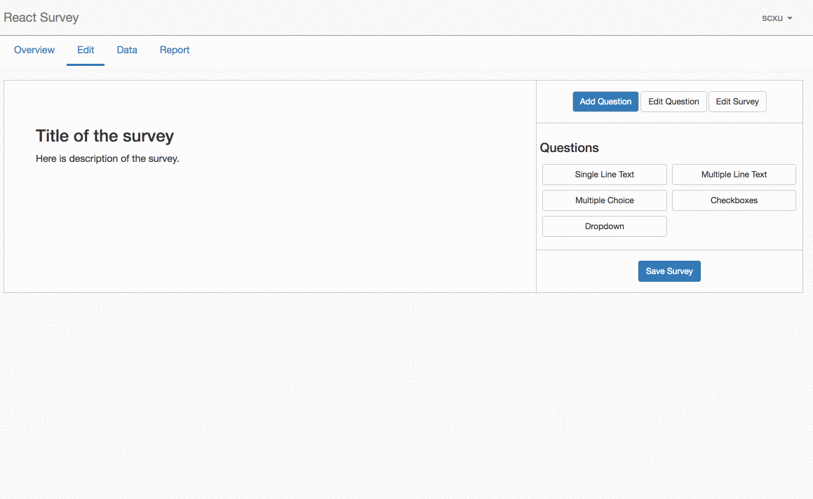
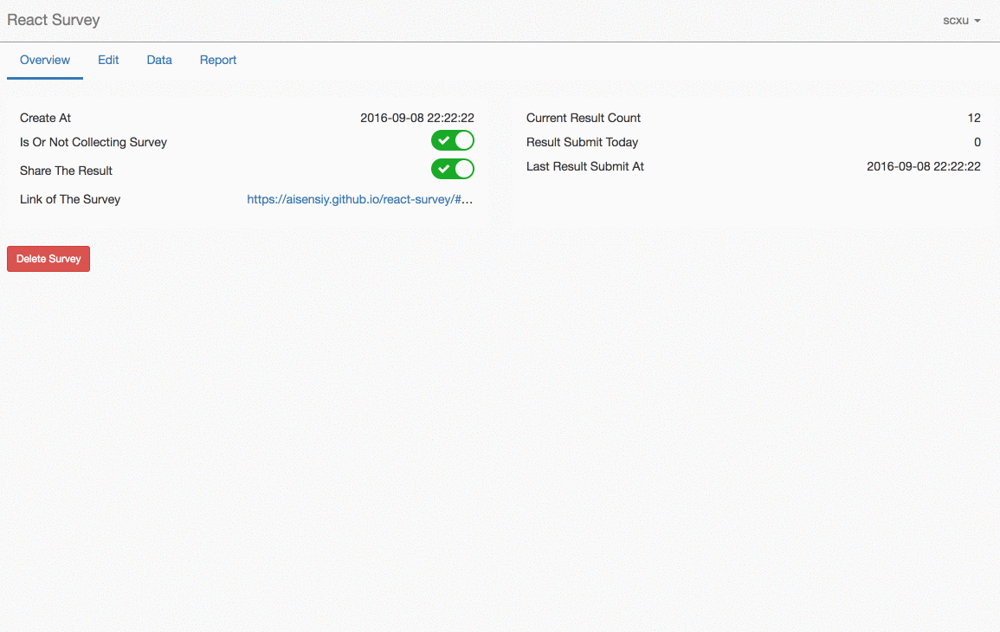
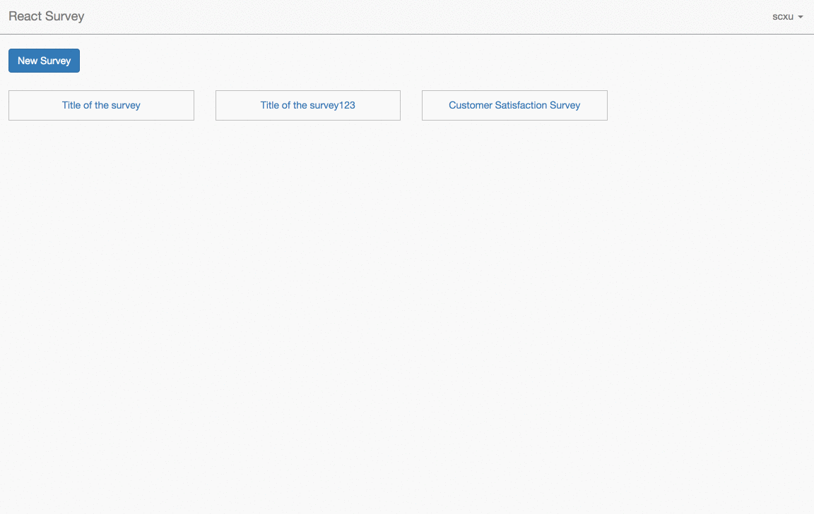
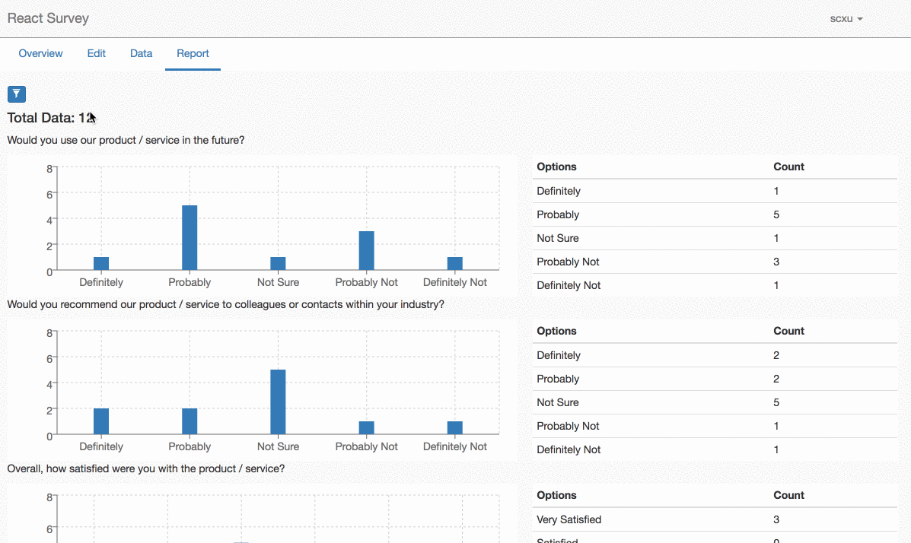

# React Survey

Right now, there are many tutorial react apps to show how to make it work with redux and react, but these apps do not help to learn how to handle a real project. Survey or questionaier is a well-known problem. React Survey is a project show how to use redux and react build a more complicated web application.

See live demo [here](https://aisensiy.github.io/react-survey)

## Features

### Survey editor



### Survey collect



### Data view



### Report process



## Run

```
npm install
npm start
```

## Use Redux

Redux is a well-known flux style state management framework. Learn more from [http://redux.js.org/](http://redux.js.org/)

## Use Rails as Backend API

[Backend API Project](https://github.com/aisensiy/rails-survey-backend)

## Use create react app

[create-react-app](https://github.com/facebookincubator/create-react-app) to Create React apps with no build configuration.
